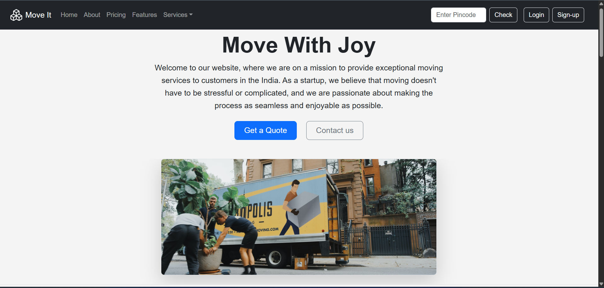
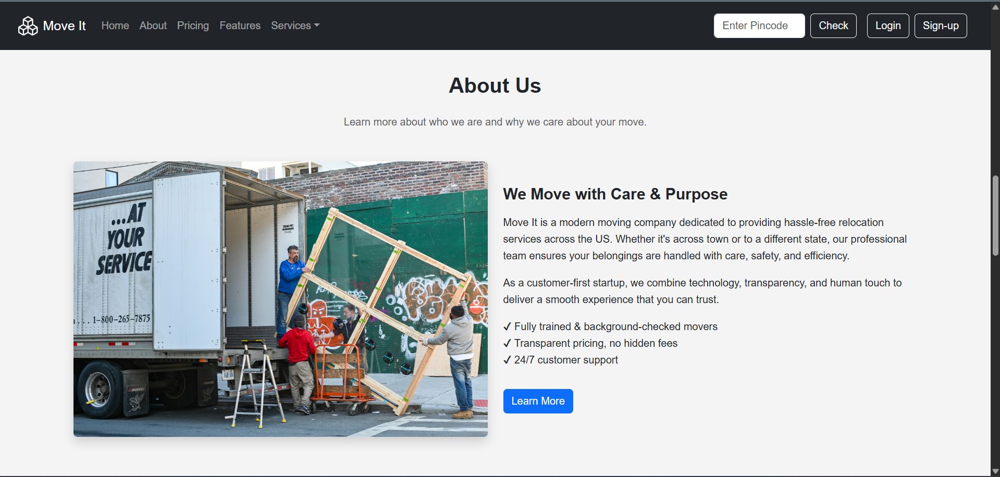
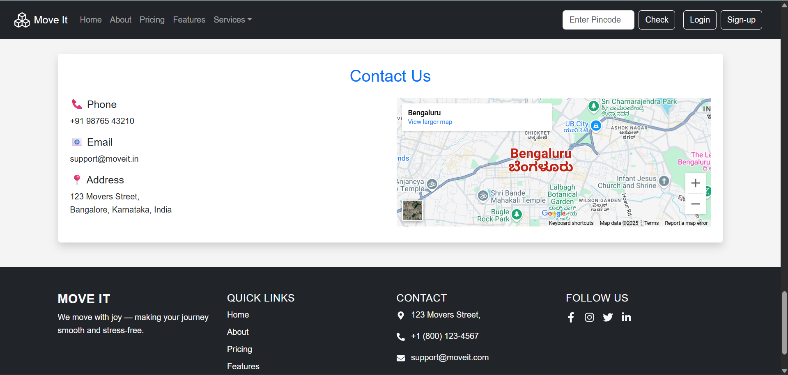

# Move It - Full Stack Moving Services Web App

A modern web application for professional moving services across the India.

## 🚀 Features

- Built with **React + Vite**
- Responsive UI with clean design
- React Router for navigation
- Pincode search functionality
- About, Features, Services, and Pricing sections
- Future plan: Add backend for booking and tracking

## 🖥️ Demo

👉 [Live Demo](https://your-deployed-link.vercel.app/) *(replace with your actual link)*

## 📸 Screenshots

## 🛠️ Technologies Used

- React
- JavaScript (ES6+)
- HTML5 & CSS3
- Bootstrap
- React Router
- Vite

## 📂 Folder Structure

